# EduTrack360 - Complete Project Documentation

## Table of Contents
1. [Project Overview](#1-project-overview)
2. [Technology Stack](#2-technology-stack)
3. [System Architecture](#3-system-architecture)
4. [Core Modules](#4-core-modules)
5. [Entity Relationship Diagram](#5-entity-relationship-diagram)
6. [Security Architecture](#6-security-architecture)
7. [API Design](#7-api-design)
8. [WebSocket Communication](#8-websocket-communication)
9. [Sequence Diagrams](#9-sequence-diagrams)
10. [System Architecture Diagram](#10-system-architecture-diagram)
11. [Deployment Guide](#11-deployment-guide)

---

## 1. Project Overview

### 1.1 Introduction
**EduTrack360** is a comprehensive, multi-tenant school management platform backend built with Java 21 and Spring Boot 3. The system provides RESTful APIs for managing schools, users, students, buses, notifications, and communications between parents, teachers, and school administrators.

### 1.2 Key Features
- **Multi-Tenant School Management**: Complete isolation between schools with customizable branding
- **Real-Time Bus Tracking**: GPS-based live tracking with WebSocket updates
- **Emergency Notifications**: Instant alerts to parents and staff
- **Parent-School Communication**: Secure messaging system between teachers and parents
- **User & Student Management**: Comprehensive user lifecycle management
- **Role-Based Access Control (RBAC)**: Six distinct user roles with granular permissions
- **JWT Authentication**: Stateless, secure authentication with refresh tokens

### 1.3 Business Value
- Enhances parent engagement with real-time transportation visibility
- Streamlines school administration operations
- Provides emergency communication channels for safety
- Enables multi-school management from a single platform

---

## 2. Technology Stack

| Component | Technology | Version | Purpose |
|-----------|------------|---------|---------|
| **Runtime** | Java | 21 | Primary programming language |
| **Framework** | Spring Boot | 3.5.10 | Application framework |
| **Security** | Spring Security + JWT | 6.x | Authentication & Authorization |
| **ORM** | Spring Data JPA + Hibernate | 6.x | Database access |
| **Real-Time** | WebSocket (STOMP over SockJS) | - | Live updates |
| **Database (Dev)** | H2 | 2.x | In-memory development database |
| **Database (Prod)** | MySQL | 8.0+ | Production database |
| **Build Tool** | Maven | 3.8+ | Dependency management & build |
| **Code Generation** | Lombok | 1.18+ | Boilerplate reduction |
| **API Docs** | OpenAPI/Swagger | 3.x | API documentation |

### 2.1 Key Dependencies
```xml
- spring-boot-starter-web        - REST API support
- spring-boot-starter-security   - Security framework
- spring-boot-starter-data-jpa   - Database ORM
- spring-boot-starter-websocket  - WebSocket support
- spring-boot-starter-validation - Input validation
- jjwt-api                       - JWT token handling
- springdoc-openapi              - Swagger UI generation
- lombok                         - Code simplification
```

---

## 3. System Architecture

### 3.1 Architectural Pattern
EduTrack360 follows a **Layered Architecture** pattern with the following layers:

```
┌─────────────────────────────────────────────────────────────┐
│                    Presentation Layer                        │
│  (REST Controllers, WebSocket Controllers, API Endpoints)    │
├─────────────────────────────────────────────────────────────┤
│                     Service Layer                            │
│    (Business Logic, Transaction Management, Validation)      │
├─────────────────────────────────────────────────────────────┤
│                    Repository Layer                          │
│        (Data Access, JPA Repositories, Queries)              │
├─────────────────────────────────────────────────────────────┤
│                     Entity Layer                             │
│           (Domain Models, JPA Entities, Enums)               │
├─────────────────────────────────────────────────────────────┤
│                   Infrastructure Layer                       │
│   (Security, Configuration, Exception Handling, DTOs)        │
└─────────────────────────────────────────────────────────────┘
```

### 3.2 Multi-Tenant Architecture
- **Tenant Isolation**: Each school operates as an isolated tenant
- **Shared Infrastructure**: Single codebase serving multiple schools
- **Data Segregation**: `school_id` foreign key discrimination
- **Branding Support**: Customizable logos, colors per school

### 3.3 Project Package Structure
```
com.edutrack.edutrack/
├── config/                 # Configuration classes
│   ├── AsyncConfig.java        - Async task configuration
│   ├── DataInitializer.java    - Test data seeding
│   ├── OpenApiConfig.java      - Swagger configuration
│   ├── SecurityConfig.java     - Security configuration
│   └── WebSocketConfig.java    - WebSocket configuration
│
├── controller/             # REST & WebSocket Controllers
│   ├── AuthController.java          - Authentication endpoints
│   ├── BusController.java           - Bus management
│   ├── BusTrackingWebSocketController.java - Real-time tracking
│   ├── DashboardController.java     - Dashboard statistics
│   ├── DeviceTokenController.java   - Push notification tokens
│   ├── MessageController.java       - Messaging system
│   ├── NotificationController.java  - Notifications
│   ├── ParentController.java        - Parent-specific APIs
│   ├── PublicController.java        - Public endpoints
│   ├── StudentController.java       - Student management
│   ├── SystemAdminSchoolController.java - School administration
│   └── UserController.java          - User management
│
├── dto/                    # Data Transfer Objects
│   ├── request/                - Incoming request DTOs
│   └── response/               - Outgoing response DTOs
│
├── entity/                 # JPA Entities
│   ├── enums/                  - Enumeration types
│   ├── Bus.java, BusLocation.java, BusRoute.java
│   ├── Message.java, MessageRecipient.java, MessageReply.java
│   ├── Notification.java, NotificationRecipient.java
│   ├── School.java, Student.java, User.java
│   └── ... (other entities)
│
├── exception/              # Custom Exceptions
│   ├── GlobalExceptionHandler.java
│   ├── ResourceNotFoundException.java
│   ├── BadRequestException.java
│   └── UnauthorizedException.java
│
├── repository/             # JPA Repositories
│   └── (18 repository interfaces)
│
├── security/               # Security Components
│   ├── CustomUserDetailsService.java
│   ├── JwtAuthenticationEntryPoint.java
│   ├── JwtAuthenticationFilter.java
│   ├── JwtTokenProvider.java
│   └── UserPrincipal.java
│
└── service/                # Business Logic Services
    ├── AuthService.java
    ├── BusService.java
    ├── DashboardService.java
    ├── MessageService.java
    ├── NotificationService.java
    ├── SchoolService.java
    ├── StudentService.java
    └── UserService.java
```

---

## 4. Core Modules

### 4.1 Authentication Module (`AuthService`)
Handles user authentication with JWT tokens.

**Key Features:**
- Username/email login
- Access token generation (15-minute expiry)
- Refresh token rotation (7-day expiry)
- Password change functionality
- Session invalidation on logout

**Process Flow:**
1. User submits credentials
2. Spring Security authenticates against database
3. JWT access token generated with user claims (userId, schoolId, role)
4. Refresh token created and stored in database
5. Both tokens returned to client

### 4.2 School Management Module (`SchoolService`)
Multi-tenant school administration for system administrators.

**Key Features:**
- Create/update schools with branding
- Manage school status (active, suspended, inactive)
- Subscription plan management
- Public branding endpoint for white-labeling

**Entities:**
- `School`: Core tenant entity with branding info

### 4.3 User Management Module (`UserService`)
User lifecycle management within schools.

**Key Features:**
- CRUD operations for users
- Role assignment (Principal → Teacher → Parent)
- Profile management
- Status management (active, inactive, suspended)

**User Roles:**
| Role | Access Level | Capabilities |
|------|--------------|--------------|
| SYSTEM_ADMIN | Global | Manage all schools |
| PRINCIPAL | School-wide | Full school admin |
| ASSISTANT_PRINCIPAL | School-wide | Delegated admin |
| TEACHER | Class-specific | View students, message parents |
| PARENT | Student-specific | Track bus, receive notifications |
| STUDENT | Self-only | View own information |

### 4.4 Student Management Module (`StudentService`)
Student records and parent relationships.

**Key Features:**
- Student enrollment and profile management
- Parent-student relationship mapping
- Teacher assignments
- Integration with bus assignments

**Entities:**
- `Student`: Student profile with enrollment info
- `ParentStudentRelationship`: Links parents to students

### 4.5 Bus Tracking Module (`BusService`)
Real-time GPS tracking for school buses.

**Key Features:**
- Bus fleet management
- Route and stop configuration
- Real-time location updates via WebSocket
- Student bus assignments
- ETA calculations

**Entities:**
- `Bus`: Vehicle information
- `BusRoute`: Named routes (pickup/dropoff)
- `RouteStop`: Individual stops with coordinates
- `BusLocation`: GPS location snapshots
- `StudentBusAssignment`: Student-to-bus mapping

**Real-Time Flow:**
1. Driver app sends GPS coordinates
2. Server receives via WebSocket (`/app/buses/{busId}/location`)
3. Location persisted to database
4. Broadcast to subscribers (`/topic/bus/{busId}/location`)
5. Parent app updates map in real-time

### 4.6 Notification Module (`NotificationService`)
Emergency and informational notifications.

**Key Features:**
- Emergency broadcasts (school-wide or bus-specific)
- WebSocket push to connected clients
- Read/acknowledge tracking
- Push notification integration (FCM ready)

**Notification Types:**
- `EMERGENCY`: Critical alerts
- `INFO`: General information
- `ALERT`: Important notices

**Categories:**
- `BUS_DELAY`, `BUS_ARRIVAL`, `BUS_DEPARTURE`
- `SCHOOL_CLOSURE`, `EMERGENCY`
- `GENERAL`, `ACADEMIC`

### 4.7 Messaging Module (`MessageService`)
Secure communication between users.

**Key Features:**
- Direct and broadcast messaging
- Message threads with replies
- Read status tracking
- Attachment support (structure ready)
- Priority levels (normal, urgent, critical)

**Entities:**
- `Message`: Message content and metadata
- `MessageRecipient`: Recipient tracking
- `MessageReply`: Threaded replies
- `MessageAttachment`: File attachments

### 4.8 Dashboard Module (`DashboardService`)
Statistics and metrics aggregation.

**Key Features:**
- School-level statistics (users, students, buses)
- Parent-specific statistics (children, notifications)
- Quick access to unread counts

---

## 5. Entity Relationship Diagram

```
                                    ┌──────────────────┐
                                    │      School      │
                                    ├──────────────────┤
                                    │ id               │
                                    │ tenantId         │
                                    │ schoolName       │
                                    │ subdomain        │
                                    │ logoUrl          │
                                    │ primaryColor     │
                                    │ secondaryColor   │
                                    │ subscriptionPlan │
                                    │ status           │
                                    └────────┬─────────┘
                                             │
           ┌─────────────────────────────────┼─────────────────────────────────┐
           │                                 │                                 │
           ▼                                 ▼                                 ▼
┌──────────────────┐              ┌──────────────────┐              ┌──────────────────┐
│       User       │              │     Student      │              │       Bus        │
├──────────────────┤              ├──────────────────┤              ├──────────────────┤
│ id               │              │ id               │              │ id               │
│ school_id (FK)   │◄────┐        │ school_id (FK)   │              │ school_id (FK)   │
│ username         │     │        │ user_id (FK)     │──────────────│ busNumber        │
│ email            │     │        │ studentNumber    │              │ licensePlate     │
│ passwordHash     │     │        │ firstName        │              │ capacity         │
│ firstName        │     │        │ lastName         │              │ driverName       │
│ lastName         │     │        │ gradeLevel       │              │ driverPhone      │
│ role             │     │        │ status           │              │ status           │
│ status           │     │        └────────┬─────────┘              └────────┬─────────┘
└────────┬─────────┘     │                 │                                 │
         │               │                 │                                 │
         │               │                 │                                 │
         ▼               │                 ▼                                 ▼
┌──────────────────┐     │     ┌────────────────────────────┐    ┌──────────────────┐
│  RefreshToken    │     │     │ ParentStudentRelationship  │    │    BusRoute      │
├──────────────────┤     │     ├────────────────────────────┤    ├──────────────────┤
│ id               │     │     │ id                         │    │ id               │
│ user_id (FK)     │     │     │ parent_user_id (FK)        │────│ bus_id (FK)      │
│ token            │     │     │ student_id (FK)            │    │ routeName        │
│ expiryDate       │     │     │ relationshipType           │    │ routeType        │
└──────────────────┘     │     │ isPrimaryContact           │    │ active           │
                         │     └────────────────────────────┘    └────────┬─────────┘
         ┌───────────────┘                                                │
         │                                                                ▼
         │                                                     ┌──────────────────┐
         │      ┌──────────────────┐                           │   RouteStop      │
         │      │  DeviceToken     │                           ├──────────────────┤
         │      ├──────────────────┤                           │ id               │
         │      │ id               │                           │ route_id (FK)    │
         └─────►│ user_id (FK)     │                           │ stopOrder        │
                │ token            │                           │ stopName         │
                │ platform         │                           │ latitude         │
                │ deviceName       │                           │ longitude        │
                └──────────────────┘                           │ estimatedTime    │
                                                               └──────────────────┘

┌──────────────────┐              ┌──────────────────┐              ┌──────────────────┐
│   Notification   │              │     Message      │              │   BusLocation    │
├──────────────────┤              ├──────────────────┤              ├──────────────────┤
│ id               │              │ id               │              │ id               │
│ school_id (FK)   │              │ school_id (FK)   │              │ bus_id (FK)      │
│ type             │              │ sender_id (FK)   │              │ latitude         │
│ category         │              │ subject          │              │ longitude        │
│ title            │              │ body             │              │ speed            │
│ message          │              │ messageType      │              │ heading          │
│ bus_id (FK)      │              │ priority         │              │ accuracy         │
│ created_by (FK)  │              │ sentAt           │              │ recordedAt       │
└────────┬─────────┘              └────────┬─────────┘              └──────────────────┘
         │                                 │
         ▼                                 ▼
┌────────────────────────┐      ┌──────────────────────┐
│ NotificationRecipient  │      │  MessageRecipient    │
├────────────────────────┤      ├──────────────────────┤
│ id                     │      │ id                   │
│ notification_id (FK)   │      │ message_id (FK)      │
│ user_id (FK)           │      │ user_id (FK)         │
│ status                 │      │ status               │
│ readAt                 │      │ readAt               │
│ acknowledgedAt         │      └──────────────────────┘
└────────────────────────┘

┌────────────────────────────┐
│  StudentBusAssignment      │
├────────────────────────────┤
│ id                         │
│ student_id (FK)            │
│ bus_id (FK)                │
│ pickup_stop_id (FK)        │
│ dropoff_stop_id (FK)       │
│ active                     │
│ assignedAt                 │
└────────────────────────────┘
```

---

## 6. Security Architecture

### 6.1 Authentication Flow
```
Client                  Server                    Database
  │                        │                          │
  │  POST /api/auth/login  │                          │
  │  {username, password}  │                          │
  │───────────────────────►│                          │
  │                        │  Query user by username  │
  │                        │─────────────────────────►│
  │                        │◄─────────────────────────│
  │                        │  Verify BCrypt password  │
  │                        │  Generate JWT tokens     │
  │                        │  Store refresh token     │
  │                        │─────────────────────────►│
  │  {accessToken,         │◄─────────────────────────│
  │   refreshToken, user}  │                          │
  │◄───────────────────────│                          │
```

### 6.2 JWT Token Structure
**Access Token Claims:**
```json
{
  "sub": "userId",
  "schoolId": 123,
  "role": "TEACHER",
  "iat": 1708300800,
  "exp": 1708301700
}
```

### 6.3 Request Authentication Flow
```
Client                     JwtFilter                   Controller
  │                           │                            │
  │  GET /api/resource        │                            │
  │  Authorization: Bearer... │                            │
  │──────────────────────────►│                            │
  │                           │ Extract token from header  │
  │                           │ Validate JWT signature     │
  │                           │ Load user from database    │
  │                           │ Set SecurityContext        │
  │                           │───────────────────────────►│
  │                           │                            │ Check @PreAuthorize
  │                           │                            │ Execute business logic
  │                           │◄───────────────────────────│
  │◄──────────────────────────│ Return response            │
```

### 6.4 Role-Based Access Control

| Endpoint Pattern | Allowed Roles |
|-----------------|---------------|
| `/api/auth/**` | Public |
| `/api/public/**` | Public |
| `/api/admin/schools/**` | SYSTEM_ADMIN |
| `/api/users/**` | PRINCIPAL, ASSISTANT_PRINCIPAL |
| `/api/students/**` | PRINCIPAL, ASSISTANT_PRINCIPAL, TEACHER |
| `/api/buses/**` | PRINCIPAL, ASSISTANT_PRINCIPAL, TEACHER |
| `/api/parent/**` | PARENT |
| `/api/notifications/**` | All authenticated |
| `/api/messages/**` | All authenticated |

### 6.5 Password Security
- **Algorithm**: BCrypt
- **Strength**: 10 rounds (default)
- **Storage**: Hashed passwords only

---

## 7. API Design

### 7.1 RESTful Conventions
- **Base URL**: `/api`
- **Versioning**: Path-based (future: `/api/v1`)
- **Response Format**: JSON
- **Error Format**: Consistent error response DTO

### 7.2 API Endpoint Summary

#### Authentication (`/api/auth`)
| Method | Endpoint | Description |
|--------|----------|-------------|
| POST | `/login` | Authenticate user |
| POST | `/refresh` | Refresh access token |
| POST | `/logout` | Invalidate session |
| POST | `/change-password` | Change user password |

#### School Administration (`/api/admin/schools`)
| Method | Endpoint | Description |
|--------|----------|-------------|
| POST | `/` | Create school |
| GET | `/` | List all schools |
| GET | `/{id}` | Get school details |
| PUT | `/{id}` | Update school |
| PATCH | `/{id}/status` | Change school status |

#### Users (`/api/users`)
| Method | Endpoint | Description |
|--------|----------|-------------|
| GET | `/me` | Get current user profile |
| PUT | `/me` | Update own profile |
| GET | `/` | List users (with pagination) |
| POST | `/` | Create user |
| GET | `/{id}` | Get user by ID |
| PUT | `/{id}` | Update user |
| PATCH | `/{id}/status` | Update user status |

#### Students (`/api/students`)
| Method | Endpoint | Description |
|--------|----------|-------------|
| POST | `/` | Create student |
| GET | `/` | List students |
| GET | `/{id}` | Get student |
| PUT | `/{id}` | Update student |
| GET | `/{id}/parents` | Get student's parents |
| POST | `/relationships` | Link parent to student |
| DELETE | `/relationships/{id}` | Remove relationship |

#### Buses (`/api/buses`)
| Method | Endpoint | Description |
|--------|----------|-------------|
| POST | `/` | Create bus |
| GET | `/` | List buses |
| GET | `/{id}` | Get bus details |
| PUT | `/{id}` | Update bus |
| GET | `/{id}/location` | Get current location |
| POST | `/{id}/location` | Update location |
| GET | `/{id}/route` | Get bus routes |
| POST | `/routes` | Create route |
| GET | `/{id}/assignments` | Get student assignments |
| POST | `/assignments` | Assign student to bus |

#### Notifications (`/api/notifications`)
| Method | Endpoint | Description |
|--------|----------|-------------|
| POST | `/emergency` | Send emergency notification |
| POST | `/bus/{busId}/broadcast` | Broadcast to bus parents |
| GET | `/my-notifications` | Get user's notifications |
| GET | `/unread` | Get unread notifications |
| GET | `/unread/count` | Get unread count |
| PATCH | `/{id}/read` | Mark as read |
| PATCH | `/{id}/acknowledge` | Acknowledge notification |

#### Messages (`/api/messages`)
| Method | Endpoint | Description |
|--------|----------|-------------|
| POST | `/send` | Send message |
| GET | `/inbox` | Get received messages |
| GET | `/sent` | Get sent messages |
| GET | `/unread` | Get unread messages |
| GET | `/unread/count` | Get unread count |
| GET | `/{id}` | Get message by ID |
| PATCH | `/{id}/mark-read` | Mark as read |
| POST | `/{id}/reply` | Reply to message |
| GET | `/{id}/replies` | Get message replies |

#### Parent Portal (`/api/parent`)
| Method | Endpoint | Description |
|--------|----------|-------------|
| GET | `/students` | Get parent's children |
| GET | `/students/{id}/bus` | Get child's bus assignment |
| GET | `/buses/{busId}/location` | Track bus location |
| GET | `/buses/{busId}/route` | Get bus route |

### 7.3 Response DTOs

**Successful Response:**
```json
{
  "success": true,
  "message": "Operation successful",
  "data": { ... }
}
```

**Paginated Response:**
```json
{
  "content": [...],
  "page": 0,
  "size": 20,
  "totalElements": 100,
  "totalPages": 5,
  "first": true,
  "last": false
}
```

**Error Response:**
```json
{
  "success": false,
  "message": "Resource not found",
  "error": "ResourceNotFoundException",
  "timestamp": "2026-02-18T10:30:00Z"
}
```

---

## 8. WebSocket Communication

### 8.1 Configuration
- **Endpoint**: `ws://localhost:8080/ws`
- **Protocol**: STOMP over SockJS
- **Destination Prefixes**:
  - `/app` - Application destinations (client → server)
  - `/topic` - Broadcast destinations
  - `/queue` - User-specific queues
  - `/user` - User-destination prefix

### 8.2 WebSocket Endpoints

#### Bus Location Tracking
```
Client Send:    /app/buses/{busId}/location
Subscription:   /topic/bus/{busId}/location
Payload:        { latitude, longitude, speed, heading, accuracy }
```

#### User Notifications
```
Subscription:   /user/queue/notifications
Payload:        NotificationResponse object
```

#### User Messages
```
Subscription:   /user/queue/messages
Payload:        MessageResponse object
```

### 8.3 WebSocket Connection Flow
```
Client                    Server
  │                          │
  │  CONNECT /ws (SockJS)    │
  │─────────────────────────►│
  │  CONNECTED               │
  │◄─────────────────────────│
  │                          │
  │  SUBSCRIBE /topic/bus/1/location
  │─────────────────────────►│
  │  SUBSCRIBED              │
  │◄─────────────────────────│
  │                          │
  │  MESSAGE                 │ (When bus location updates)
  │◄─────────────────────────│
  │                          │
```

---

## 9. Sequence Diagrams

### 9.1 User Authentication Sequence

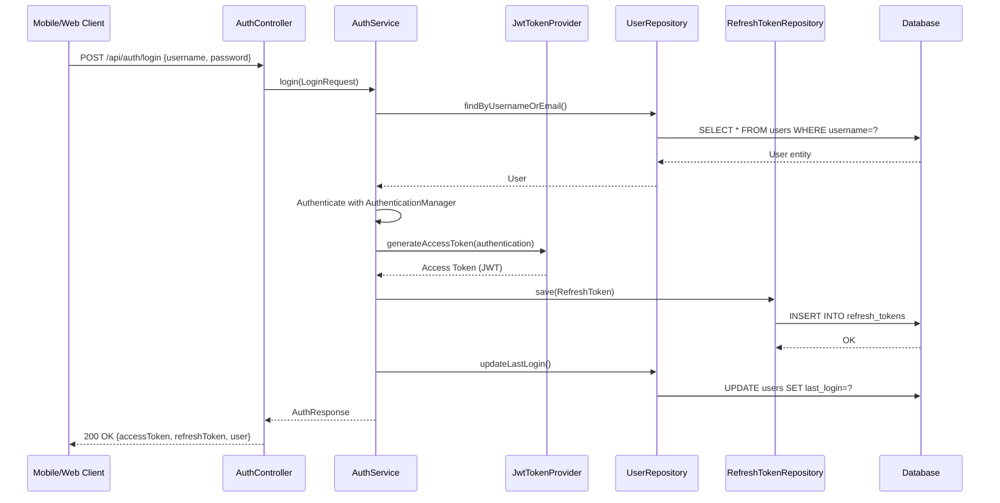

### 9.2 Bus Location Update Sequence (Real-Time)

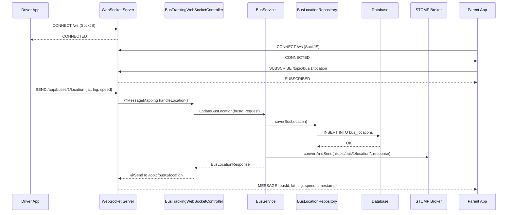

### 9.3 Emergency Notification Sequence

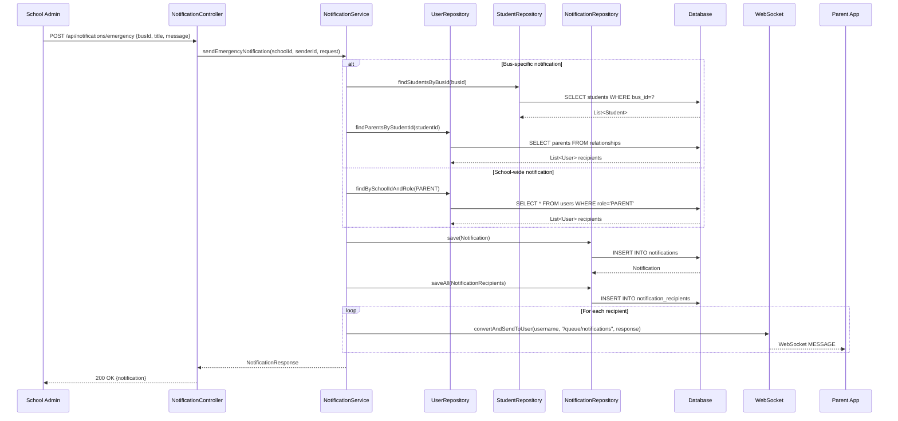

### 9.4 Send Message Sequence

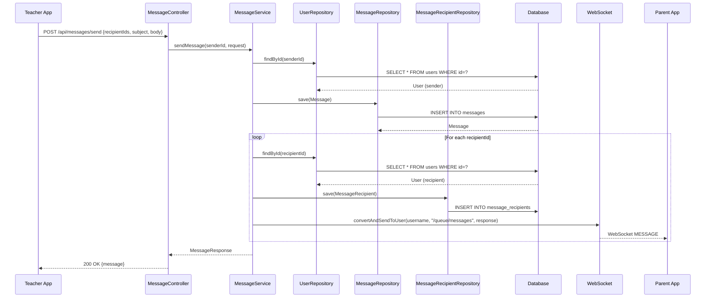

### 9.5 Student Bus Assignment Sequence

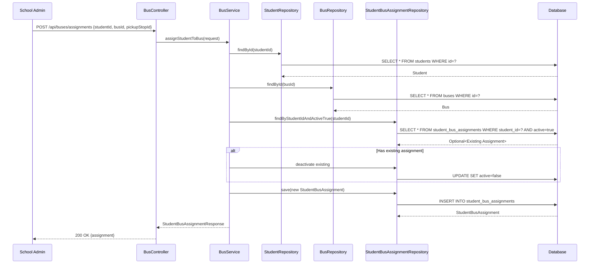

### 9.6 Token Refresh Sequence

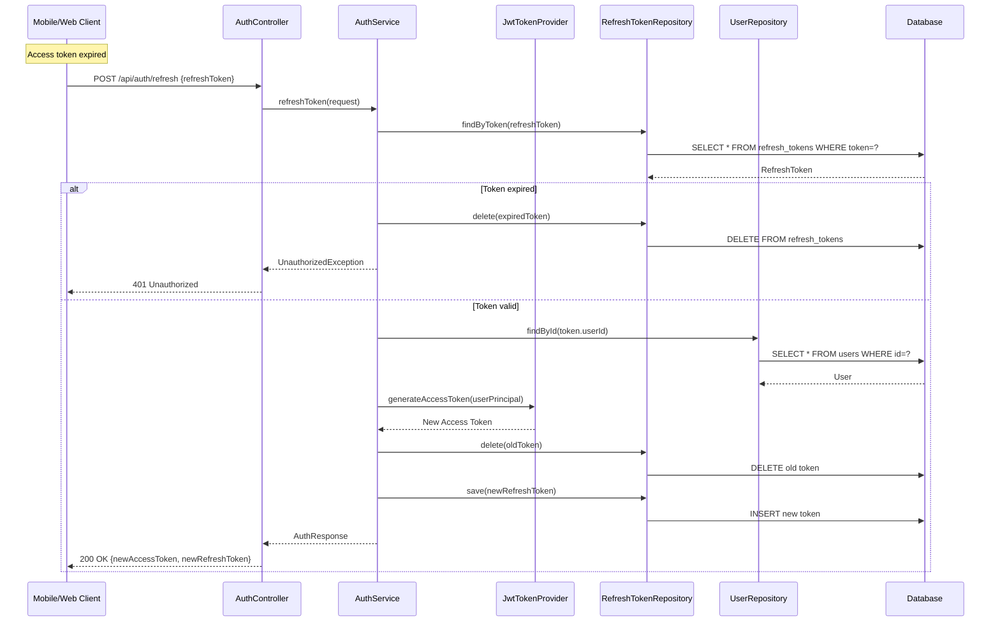

---

## 10. System Architecture Diagram

### 10.1 High-Level Architecture

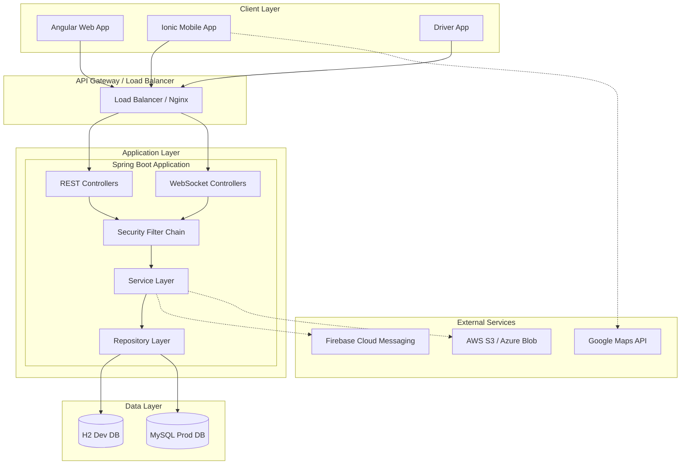

### 10.2 Component Architecture

```mermaid
graph TB
    subgraph "Presentation Layer"
        AuthCtrl[AuthController]
        UserCtrl[UserController]
        StudentCtrl[StudentController]
        BusCtrl[BusController]
        MsgCtrl[MessageController]
        NotifCtrl[NotificationController]
        WSCtrl[WebSocket Controller]
    end

    subgraph "Security Layer"
        JwtFilter[JwtAuthenticationFilter]
        JwtProvider[JwtTokenProvider]
        UserDetails[CustomUserDetailsService]
        EntryPoint[JwtAuthenticationEntryPoint]
    end

    subgraph "Service Layer"
        AuthSvc[AuthService]
        UserSvc[UserService]
        StudentSvc[StudentService]
        BusSvc[BusService]
        MsgSvc[MessageService]
        NotifSvc[NotificationService]
        SchoolSvc[SchoolService]
        DashSvc[DashboardService]
    end

    subgraph "Repository Layer"
        UserRepo[UserRepository]
        StudentRepo[StudentRepository]
        SchoolRepo[SchoolRepository]
        BusRepo[BusRepository]
        MsgRepo[MessageRepository]
        NotifRepo[NotificationRepository]
        TokenRepo[RefreshTokenRepository]
    end

    subgraph "Entity Layer"
        User[User]
        Student[Student]
        School[School]
        Bus[Bus]
        Message[Message]
        Notification[Notification]
    end

    AuthCtrl --> AuthSvc
    UserCtrl --> UserSvc
    StudentCtrl --> StudentSvc
    BusCtrl --> BusSvc
    MsgCtrl --> MsgSvc
    NotifCtrl --> NotifSvc
    WSCtrl --> BusSvc

    AuthSvc --> UserRepo
    AuthSvc --> TokenRepo
    AuthSvc --> JwtProvider
    UserSvc --> UserRepo
    StudentSvc --> StudentRepo
    BusSvc --> BusRepo
    MsgSvc --> MsgRepo
    NotifSvc --> NotifRepo

    UserRepo --> User
    StudentRepo --> Student
    SchoolRepo --> School
    BusRepo --> Bus
    MsgRepo --> Message
    NotifRepo --> Notification
```

### 10.3 Data Flow Architecture

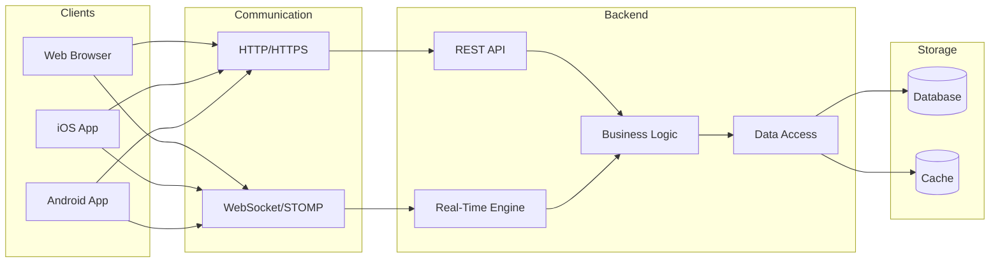

### 10.4 Security Architecture

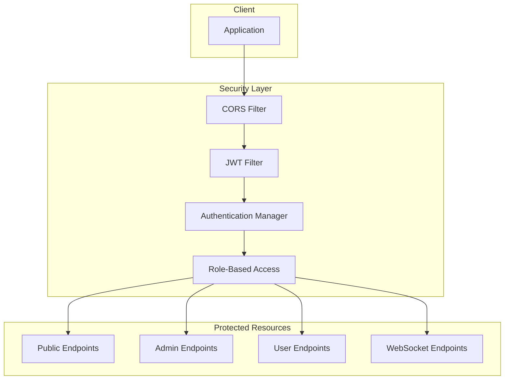

### 10.5 Multi-Tenant Architecture

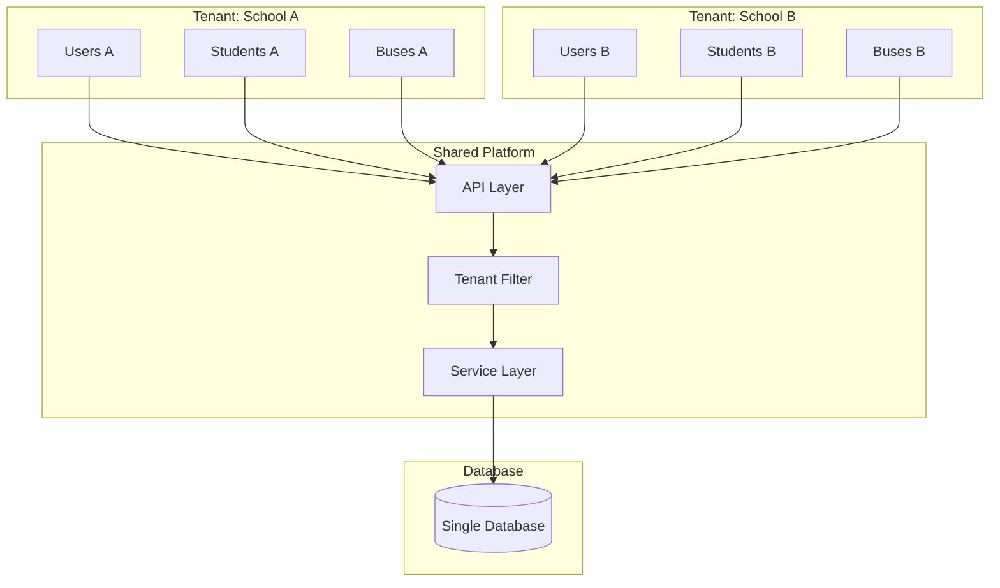

---

## 11. Deployment Guide

### 11.1 Development Setup

1. **Prerequisites**
   - Java 21 JDK
   - Maven 3.8+
   - IDE (IntelliJ IDEA recommended)

2. **Clone and Run**
   ```bash
   git clone <repository-url>
   cd edutrack
   ./mvnw spring-boot:run
   ```

3. **Access Points**
   - API: `http://localhost:8080`
   - Swagger UI: `http://localhost:8080/swagger-ui.html`
   - H2 Console: `http://localhost:8080/h2-console`

### 11.2 Production Configuration

**application.properties for MySQL:**
```properties
spring.datasource.url=jdbc:mysql://localhost:3306/edutrack?useSSL=true
spring.datasource.username=${DB_USERNAME}
spring.datasource.password=${DB_PASSWORD}
spring.jpa.properties.hibernate.dialect=org.hibernate.dialect.MySQLDialect
spring.jpa.hibernate.ddl-auto=validate
```

### 11.3 Environment Variables
| Variable | Description | Example |
|----------|-------------|---------|
| `DB_URL` | Database connection URL | `jdbc:mysql://host:3306/db` |
| `DB_USERNAME` | Database username | `edutrack_user` |
| `DB_PASSWORD` | Database password | `secure_password` |
| `JWT_SECRET` | JWT signing secret (256+ bits) | `base64-encoded-secret` |
| `JWT_EXPIRATION` | Access token TTL (ms) | `900000` |

### 11.4 Default Test Credentials

| Role | Username | Password |
|------|----------|----------|
| System Admin | sysadmin | admin123 |
| Principal | principal | principal123 |
| Asst. Principal | asstprincipal | assistant123 |
| Teacher | teacher1 | teacher123 |
| Parent | parent1 | parent123 |

---

## Appendix A: Enumeration Types

### User Roles
```java
SYSTEM_ADMIN, PRINCIPAL, ASSISTANT_PRINCIPAL, TEACHER, PARENT, STUDENT
```

### User Status
```java
ACTIVE, INACTIVE, SUSPENDED, PENDING_VERIFICATION
```

### School Status
```java
ACTIVE, SUSPENDED, INACTIVE, TRIAL
```

### Subscription Plans
```java
TRIAL, BASIC, PREMIUM, ENTERPRISE
```

### Bus Status
```java
ACTIVE, MAINTENANCE, INACTIVE
```

### Notification Types
```java
EMERGENCY, INFO, ALERT
```

### Message Priority
```java
NORMAL, URGENT, CRITICAL
```

---

## Appendix B: API Response Codes

| Code | Description |
|------|-------------|
| 200 | Successful operation |
| 201 | Resource created |
| 400 | Bad request / Validation error |
| 401 | Unauthorized / Invalid credentials |
| 403 | Forbidden / Insufficient permissions |
| 404 | Resource not found |
| 409 | Conflict / Duplicate resource |
| 500 | Internal server error |

---

*Document Version: 1.0*
*Last Updated: February 18, 2026*
*Author: EduTrack360 Development Team*

